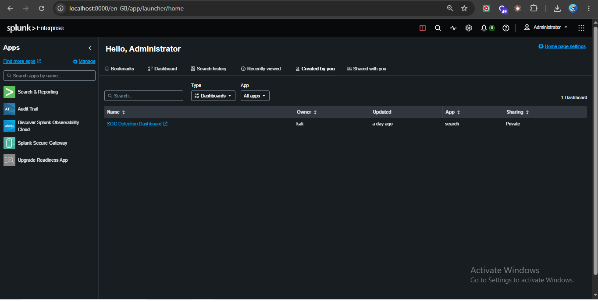
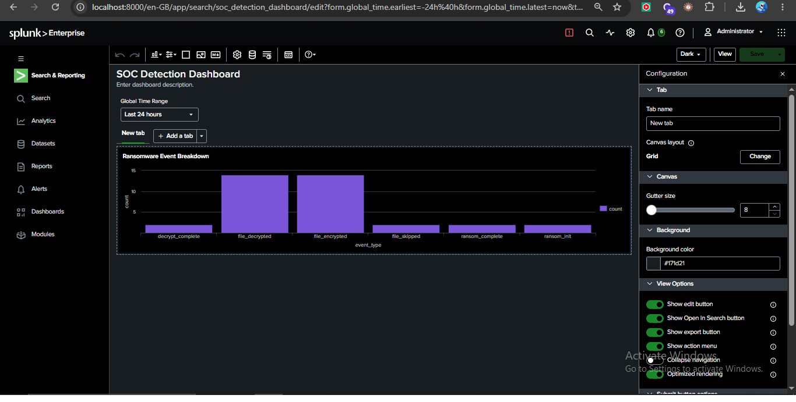
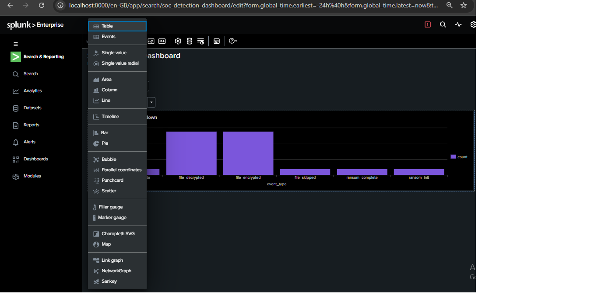
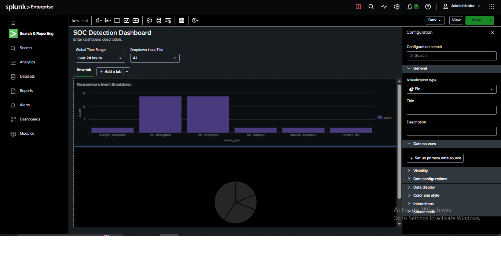
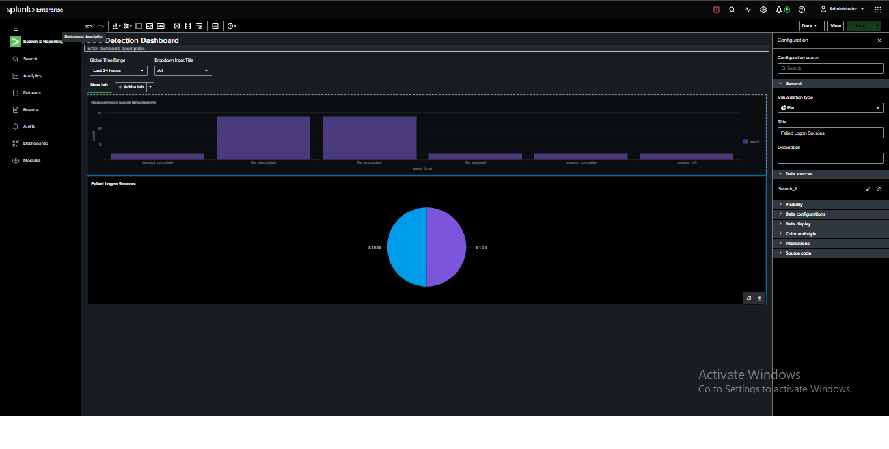

# SOC Unified Monitoring Dashboard — Multi-Source Splunk Visualization

## Objective
Combine two unrelated log sources — Windows Security Event Logs and a
custom ransomware simulation log — into a single Splunk dashboard, to
practice the "single pane of glass" monitoring approach real SOC teams
use when watching multiple detection domains at once.

## Environment
- SIEM: Splunk Enterprise (local lab)
- Data Source 1: `WinEventLog:Security` (EventCode 4625 — failed logons)
- Data Source 2: `ransom_activity_analysis` (custom JSON ransomware log)
- Dashboard: `SOC Detection Dashboard` (extended with a second panel)

## Why This Matters
A real SOC analyst doesn't watch one log type in isolation — they need
one screen showing multiple unrelated risk signals simultaneously
(auth failures, file integrity events, network anomalies, etc.).
This project simulates that by merging two independent detections into
one dashboard.

## Process

**Step 1 — Existing dashboard (single panel)**
Started from the existing dashboard showing ransomware event data only.


**Step 2 — Entered edit mode**
Opened the dashboard editor to add a second, unrelated panel.


**Step 3 — Explored visualization type options**
Reviewed available chart types before selecting Pie for the new panel.


**Step 4 — Added new empty panel, connected data source**
Added a second panel, selected Pie visualization, and attached the
failed-logon query via "Set up primary data source":
```spl
index=main sourcetype=WinEventLog:Security EventCode=4625
| stats count by Security_ID
| sort -count
```


**Step 5 — Final result: two independent data sources, one dashboard**


## Results

**Panel 1 — Ransomware Event Breakdown** (from `ransom_activity_analysis`)
| event_type | count |
|---|---|
| file_decrypted | 14 |
| file_encrypted | 14 |
| decrypt_complete | 2 |
| file_skipped | 2 |
| ransom_complete | 2 |
| ransom_init | 2 |

**Panel 2 — Failed Logon Sources** (from `WinEventLog:Security`)
| Security_ID | Count | Identity |
|---|---|---|
| S-1-0-0 | 5 | Null SID |
| S-1-5-18 | 5 | LOCAL SYSTEM |

## Findings
- Successfully unified two structurally different log formats (Windows Event Log fields vs. custom JSON) into one dashboard without needing to normalize their schemas — Splunk handles each panel's query independently.
- Panel 2 confirms (again) zero real human-driven failed logons — consistent with earlier standalone analysis, now visible alongside ransomware activity in the same view.
- This is the actual value of a SOC dashboard: cross-domain visibility in one glance, not proving any single new detection.

## What I Learned
- Dashboards in Splunk are containers — each panel can pull from a completely different index/sourcetype/query independently.
- "Unified monitoring" doesn't mean correlating the data together (that's a separate, harder task) — it means presenting multiple independent signals side-by-side for faster human triage.
- Choosing different chart types (bar vs. pie) per panel helps visually distinguish unrelated data domains at a glance.

## Next Steps
- Add a third panel from a different log source (e.g. network/Nmap scan data) to further test the multi-source dashboard concept.
- Explore Splunk's **correlation searches** to actually link events across sources (e.g. failed logon + file encryption from the same host within a time window) — the next level beyond side-by-side display.

## Related Projects
- 🔗 [Ransomware Detection & MITRE Mapping](https://github.com/CyberBros435/ransomware-siem-analysis)
- 🔗 [Failed Logon Frequency Analysis](https://github.com/CyberBros435/System_Log_Analyser)
- 🔗 [Single-Panel Dashboard (v1)](https://github.com/CyberBros435/soc-dashboard-splunk-visualization)